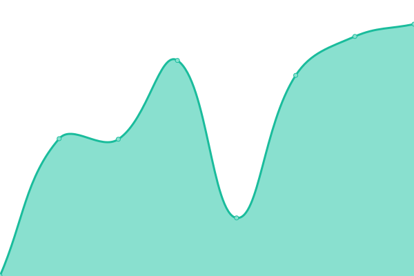
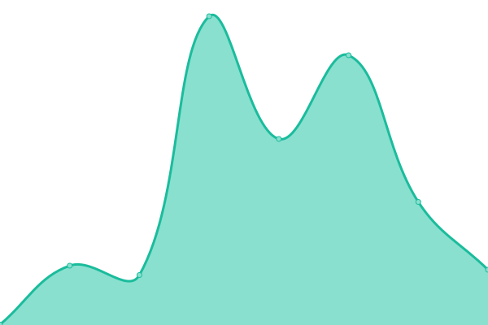
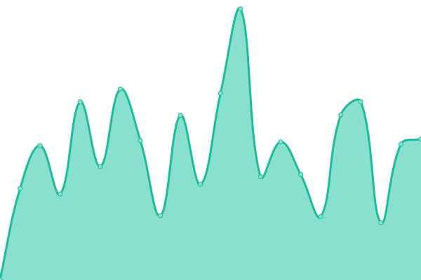

# [📈 Live Status](https://demo.upptime.js.org): <!--live status--> **🟩 All systems operational**

This repository contains the open-source uptime monitor and status page for [Upptime](https://upptime.js.org), powered by [Upptime](https://github.com/upptime/upptime).

With [Upptime](https://upptime.js.org), you can get your own unlimited and free uptime monitor and status page, powered entirely by a GitHub repository. We use [Issues](https://github.com/upptime/upptime/issues) as incident reports, [Actions](https://github.com/thesagor/status/actions) as uptime monitors, and [Pages](https://demo.upptime.js.org) for the status page.

<!--start: status pages-->
<!-- This summary is generated by Upptime (https://github.com/upptime/upptime) -->
<!-- Do not edit this manually, your changes will be overwritten -->
<!-- prettier-ignore -->
| URL | Status | History | Response Time | Uptime |
| --- | ------ | ------- | ------------- | ------ |
|  [Thought Leadership](https://thoughtleadership.biz) | 🟩 Up | [thought-leadership.yml](https://github.com/thesagor/status/commits/HEAD/history/thought-leadership.yml) | 

 364ms
     
 | 

<a href="https://status.thesagor.nl/history/thought-leadership">100.00%</a>
    

|  [Sitetrax](https://sitetrax.io) | 🟩 Up | [sitetrax.yml](https://github.com/thesagor/status/commits/HEAD/history/sitetrax.yml) | 

 1368ms
     
 | 

<a href="https://status.thesagor.nl/history/sitetrax">100.00%</a>
    

|  [Netarus](https://netarus.com) | 🟩 Up | [netarus.yml](https://github.com/thesagor/status/commits/HEAD/history/netarus.yml) | 

 344ms
     
 | 

<a href="https://status.thesagor.nl/history/netarus">100.00%</a>
    

|  [HoistCam](https://hoistcam.com) | 🟩 Up | [hoist-cam.yml](https://github.com/thesagor/status/commits/HEAD/history/hoist-cam.yml) | 

 388ms
     
 | 

<a href="https://status.thesagor.nl/history/hoist-cam">100.00%</a>
    

|  [Traxa](https://traxa.io) | 🟩 Up | [traxa.yml](https://github.com/thesagor/status/commits/HEAD/history/traxa.yml) | 

 475ms
     
 | 

<a href="https://status.thesagor.nl/history/traxa">100.00%</a>
    

|  [Machut](https://www.machut.com) | 🟩 Up | [machut.yml](https://github.com/thesagor/status/commits/HEAD/history/machut.yml) | 

 392ms
     
 | 

<a href="https://status.thesagor.nl/history/machut">100.00%</a>
    

|  [TrackMyContainer](https://trackmycontainer.io) | 🟩 Up | [track-my-container.yml](https://github.com/thesagor/status/commits/HEAD/history/track-my-container.yml) | 

 501ms
     
 | 

<a href="https://status.thesagor.nl/history/track-my-container">100.00%</a>
    

|  [Sitetrax Customer](https://customer.sitetrax.io) | 🟩 Up | [sitetrax-customer.yml](https://github.com/thesagor/status/commits/HEAD/history/sitetrax-customer.yml) | 

 645ms
     
 | 

<a href="https://status.thesagor.nl/history/sitetrax-customer">100.00%</a>
    

|  [HoistCam Customer](https://customer.hoistcam.com) | 🟩 Up | [hoist-cam-customer.yml](https://github.com/thesagor/status/commits/HEAD/history/hoist-cam-customer.yml) | 

 796ms
     
 | 

<a href="https://status.thesagor.nl/history/hoist-cam-customer">100.00%</a>
    

|  [Gorurhaat](https://gorurhaat.com) | 🟩 Up | [gorurhaat.yml](https://github.com/thesagor/status/commits/HEAD/history/gorurhaat.yml) | 

 594ms
     
 | 

<a href="https://status.thesagor.nl/history/gorurhaat">100.00%</a>
    

<!--end: status pages-->

[**Visit our status website →**](https://demo.upptime.js.org)

## 📄 License

- Powered by: [Upptime](https://github.com/upptime/upptime)
- Code: [MIT](./LICENSE) © [Anand Chowdhary](https://anandchowdhary.com), supported by [Pabio](https://pabio.com)
- Data in the `./history` directory: [Open Database License](https://opendatacommons.org/licenses/odbl/1-0/)
